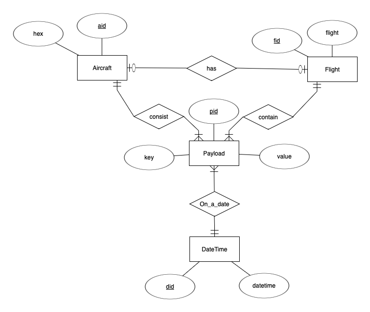
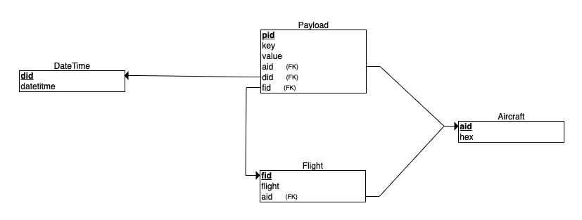
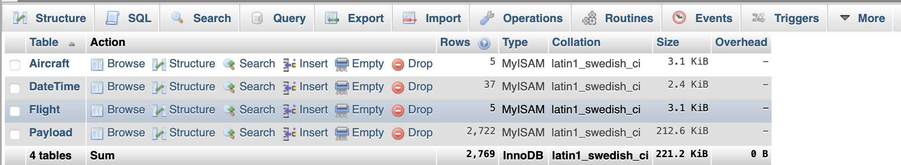
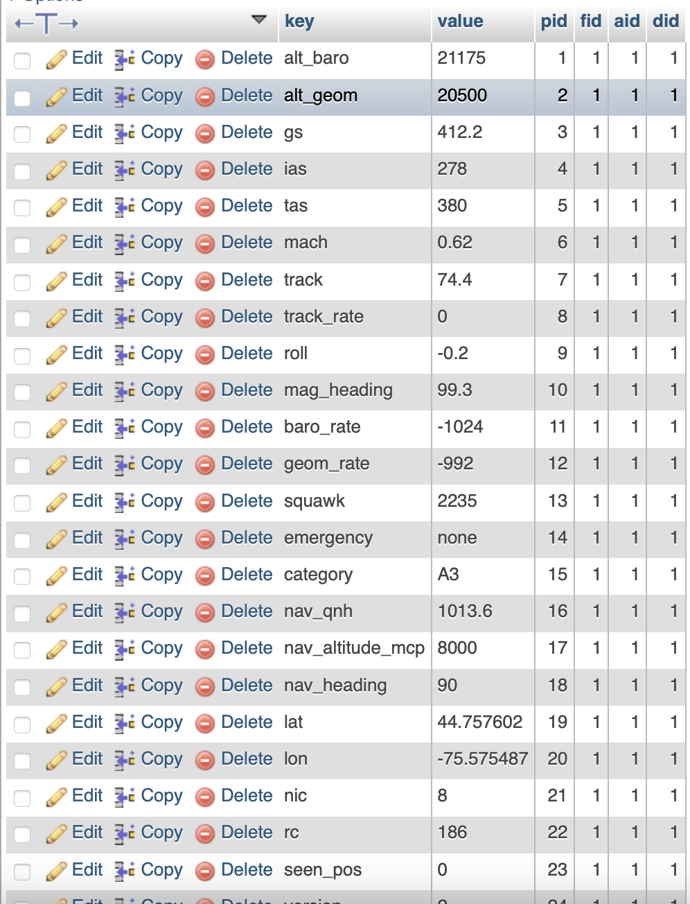
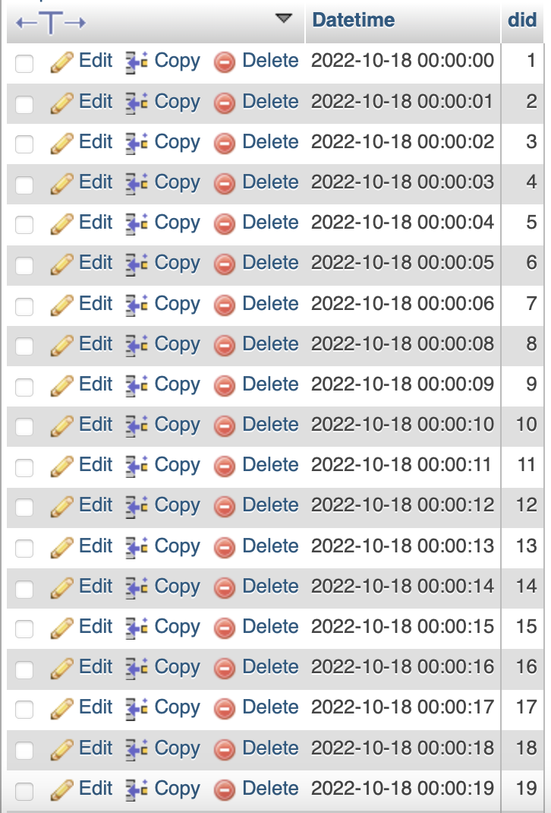
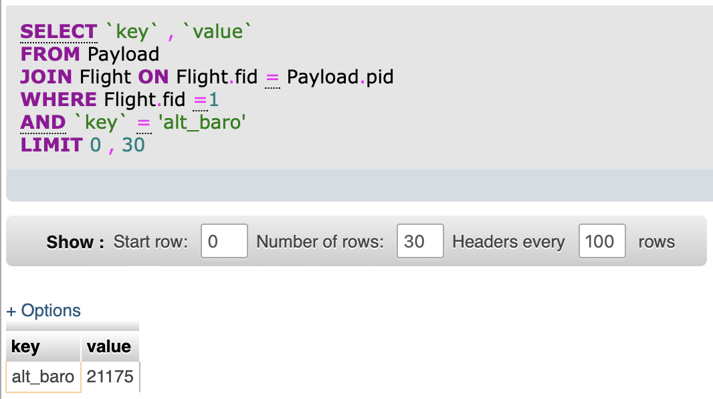

# Final Poject 

## Sample Data:


The data I have received is a text file with json format.
I have decided to iterate through the lines and clean the data first, know the logics like number of rows, columns, each dictionary values and count, missing keys and values, replacing the missing keys. 

## Initially I wanted to count the number of dictionaries in one line and iterrating through the line

```
import json
f = open("adsblog_ny0.txt.2022101800","r")
n=0
for line in f:
    data=json.loads(line)
    print(len(data['payload'].keys()))
    if n > 200:
        break
    n+=1
```


From the above trail, I got to know that each line has 3 Key-Value pairs and one of the dictionary has one more dictionary in that, which is called ‘payload’. Each ‘payload’ has multiple lengths ‘key-value’ pairs like:

{38: 76152, 17: 966, 37: 45491, 19: 773, 24: 1129, 25: 2286, 11: 804, 16: 1367, 20: 2702, 22: 1279, 27: 3943, 36: 12610, 31: 40156, 29: 8606, 23: 894, 39: 60149, 18: 574, 15: 1033, 21: 2050, 32: 5472, 34: 4697, 35: 9330, 30: 18540, 14: 514, 9: 477, 28: 36033, 33: 2356, 26: 2890, 13: 882, 6: 316, 10: 374, 12: 130, 8: 1705, 7: 605, 40: 3631}


## To find which key difference in a dictionary whose length is 17,37,19,24 etc,. You can change the length from the above values to see the difference.

```
import json
f = open("/Users/ksr/Downloads/New folder (19)/adsblog_ny0.txt.2022101800","r")
n=0
for line in f:
    data=json.loads(line)
    pk=data['payload'].keys()
    ck=data['payload'].keys()
    if len(pk)==38:
        dictoflen1=data['payload'].keys()
        continue
    if len(ck)==17:
        dictoflen2=(data['payload'].keys())
        a= dictoflen1 ^ dictoflen2
        print(a)
        if n>10:
            break
        n+=1
```

Output:
{'mag_heading', 'mlat', 'squawk', 'nac_v', 'alt_baro', 'seen', 'geom_rate', 'version', 'mach', 'tisb', 'ias', 'messages', 'rssi', 'baro_rate', 'hex', 'nav_altitude_mcp'}


## To find all the dictionaries which has flight as a key. Coverage percentage of any Key() in Payload.

```import json
f = open("adsblog_ny0.txt.2022101800","r")
n=0
for line in f:
    data=json.loads(line)
    if 'flight' in data['payload'].keys():
        print(n)
        
        n+=1
```

Output: 317842


## Coverage percentage of any Key() in Payload.
```
import json
def coverage():
    f = open("/Users/ksr/Downloads/New folder (19)/adsblog_ny0.txt.2022101800","r")
    term=input('Enter the coverage you are looking for')
    n=0
    m=0
    d=[]
    for line in f:
        data=json.loads(line)
        m+=1
        if term in data['payload'].keys():
                n+=1 
    print(f'Total Count of payload: {m} \nTotal Count of {term}: {n}')
    math=n/m*100
    print(round(math,2),'%')
   
if __name__=='__main__':
    coverage()
```
Output: Total Count of payload: 350916 
	   Total Count of alt_baro: 349181
	   99.51 %


## *Coverage for all key-value pairs in payload* 

```
import json
def coverage():
    f = open("/Users/ksr/Downloads/New folder (19)/adsblog_ny0.txt.2022101800","r")
    n=0
    d={}
    for line in f:
        data=json.loads(line)
        for word in data['payload']:
            if word in d:
                d[word]+=1
            else:
                d[word]=1
        n+=1
    for key, value in d.items():
        print(key,':',(round((value/n)*100,2),'%'))
   
if __name__=='__main__':
    coverage()
```
Output:
- hex : 100.0 % 
- flight : 90.58 %
- alt_baro : 99.51 %
- alt_geom : 97.3 %
- gs : 98.27 %
- ias : 61.25 %
- tas : 60.62 %
- mach : 61.25 %
- track : 98.27 %
- track_rate : 52.5 %
- roll : 60.62 %
- mag_heading : 61.25 %
- baro_rate : 90.41 %
- geom_rate : 65.89 %
- squawk : 93.28 %
- emergency : 88.72 %
- category : 94.44 %
- nav_qnh : 84.68 %
- nav_altitude_mcp : 84.32 %
- nav_heading : 60.58 %
- lat : 95.39 %
- lon : 95.39 %
- nic : 95.39 %
- rc : 95.39 %
- seen_pos : 95.39 %
- version : 98.49 %
- nic_baro : 96.16 %
- nac_p : 97.01 %
- nac_v : 97.63 %
- sil : 97.01 %
- sil_type : 98.18 %
- gva : 93.09 %
- sda : 93.1 %
- mlat : 100.0 %
- tisb : 100.0 %
- messages : 100.0 %
- seen : 100.0 %
- rssi : 100.0 %
- nav_altitude_fms : 17.2 %
- nav_modes : 13.41 %


## *Sample Printing Dictionaries having flight as key*
```import json
with open("/Users/ksr/Downloads/New folder (19)/adsblog_ny0.txt.2022101800","r") as json_file:
    n=0
    d=[]
    for line in json_file:
        data=json.loads(line)
        pk=data['payload'].keys()
        if 'flight' in pk:
            print(data,n)
            print('')
            if n>10:
                break
            
        n+=1
```
Output:
{'type': 'new_adsb', 'dt': '2022-10-18 00:00:00.826149', 'payload': {'hex': 'acb2ba', 'flight': 'SWQ2816 ', 'alt_baro': 21175, 'alt_geom': 20500, 'gs': 412.2, 'ias': 278, 'tas': 380, 'mach': 0.62, 'track': 74.4, 'track_rate': 0.0, 'roll': -0.2, 'mag_heading': 99.3, 'baro_rate': -1024, 'geom_rate': -992, 'squawk': '2235', 'emergency': 'none', 'category': 'A3', 'nav_qnh': 1013.6, 'nav_altitude_mcp': 8000, 'nav_heading': 90.0, 'lat': 44.757602, 'lon': -75.575487, 'nic': 8, 'rc': 186, 'seen_pos': 0.0, 'version': 2, 'nic_baro': 1, 'nac_p': 10, 'nac_v': 2, 'sil': 3, 'sil_type': 'perhour', 'gva': 2, 'sda': 2, 'mlat': [], 'tisb': [], 'messages': 509, 'seen': 0.0, 'rssi': -18.9}} 0

{'type': 'new_adsb', 'dt': '2022-10-18 00:00:01.853305', 'payload': {'hex': 'c05c7a', 'flight': 'JZA478  ', 'alt_baro': 36675, 'alt_geom': 36050, 'gs': 492.1, 'ias': 249, 'tas': 448, 'mach': 0.764, 'track': 66.4, 'track_rate': 0.0, 'roll': -0.4, 'mag_heading': 86.3, 'baro_rate': 512, 'geom_rate': 320, 'squawk': '2272', 'emergency': 'none', 'category': 'A3', 'nav_qnh': 1012.8, 'nav_altitude_mcp': 36992, 'nav_heading': 85.8, 'lat': 44.577725, 'lon': -75.879554, 'nic': 8, 'rc': 186, 'seen_pos': 6.8, 'version': 2, 'nic_baro': 1, 'nac_p': 10, 'nac_v': 1, 'sil': 3, 'sil_type': 'perhour', 'gva': 2, 'sda': 2, 'mlat': [], 'tisb': [], 'messages': 1044, 'seen': 0.0, 'rssi': -21.2}} 2

{'type': 'new_adsb', 'dt': '2022-10-18 00:00:02.880737', 'payload': {'hex': 'c05c7a', 'flight': 'JZA478  ', 'alt_baro': 36675, 'alt_geom': 36050, 'gs': 492.1, 'ias': 249, 'tas': 448, 'mach': 0.764, 'track': 66.4, 'track_rate': 0.0, 'roll': -0.4, 'mag_heading': 86.3, 'baro_rate': 512, 'geom_rate': 320, 'squawk': '2272', 'emergency': 'none', 'category': 'A3', 'nav_qnh': 1012.8, 'nav_altitude_mcp': 36992, 'nav_heading': 85.8, 'lat': 44.577725, 'lon': -75.879554, 'nic': 8, 'rc': 186, 'seen_pos': 7.8, 'version': 2, 'nic_baro': 1, 'nac_p': 10, 'nac_v': 1, 'sil': 3, 'sil_type': 'perhour', 'gva': 2, 'sda': 2, 'mlat': [], 'tisb': [], 'messages': 1045, 'seen': 0.5, 'rssi': -21.5}} 4

{'type': 'new_adsb', 'dt': '2022-10-18 00:00:03.903143', 'payload': {'hex': 'acb2ba', 'flight': 'SWQ2816 ', 'alt_baro': 21175, 'alt_geom': 20475, 'gs': 412.2, 'ias': 278, 'tas': 380, 'mach': 0.62, 'track': 74.4, 'track_rate': 0.0, 'roll': -0.2, 'mag_heading': 99.3, 'baro_rate': -1024, 'geom_rate': -992, 'squawk': '2235', 'emergency': 'none', 'category': 'A3', 'nav_qnh': 1013.6, 'nav_altitude_mcp': 8000, 'nav_heading': 90.0, 'lat': 44.757602, 'lon': -75.575487, 'nic': 8, 'rc': 186, 'seen_pos': 3.2, 'version': 2, 'nic_baro': 1, 'nac_p': 10, 'nac_v': 2, 'sil': 3, 'sil_type': 'perhour', 'gva': 2, 'sda': 2, 'mlat': [], 'tisb': [], 'messages': 510, 'seen': 0.8, '

# After analysing the data, Now its time to create ERD and Schema
**After all the analysis, operations and interpretation of data, I have decided to insert the data into the DB.Here was the imp task, the data was properly formatted nor normalised nor has any primary key (Unique column to use)**
**We have decided to create own primary keys for all the table and importantly we have used Key-Values pairs.** 

**Entity Relation**
- Every Flight keeps a track of `flightno`, `aid` and `fid` as a primary key.
- Every Aircraft table keeps a track `hex` and `aid` as a primary key.
- Each Aircraft has optional-one Flight. 
- Every Aircraft/Flight has multiple `payload`
- Payload keeps a track of `Key` and `Value`
- Each date has multiple Aircrafts/Flights


**Entity-Relation Diagram**



**Entity-Relation Schema**



## Creating a DataBase and Tables under the DB
```
import json
import Cred
import pymysql
conn=pymysql.connect(host=Cred.host, port=3306, user=Cred.user, passwd=Cred.passwd, db=Cred.db)  
cur=conn.cursor(pymysql.cursors.DictCursor)
cur.execute('''
CREATE TABLE IF NOT EXISTS `Aircraft` (
    `aid` int(11) NOT NULL AUTO_INCREMENT,
  `hex` varchar(10) NOT NULL,
  PRIMARY KEY (`aid`),
  UNIQUE KEY `hex` (`hex`)) 
  ENGINE=MyISAM  DEFAULT CHARSET=latin1 AUTO_INCREMENT=1 ;
  ''')

cur.execute('''CREATE TABLE IF NOT EXISTS `DateTime` (
  `Datetime` datetime NOT NULL,
  `did` int(11) NOT NULL AUTO_INCREMENT,
  PRIMARY KEY (`did`)
) ENGINE=MyISAM  DEFAULT CHARSET=latin1 AUTO_INCREMENT=1 ;
''')

cur.execute('''CREATE TABLE IF NOT EXISTS `Flight` (
  `flight` varchar(10) DEFAULT NULL,
  `fid` int(11) NOT NULL AUTO_INCREMENT,
  `aid` int(11) NOT NULL,
  PRIMARY KEY (`fid`),
  FOREIGN KEY (`aid`) REFERENCES AIRCRAFT(aid)
) ENGINE=MyISAM  DEFAULT CHARSET=latin1 AUTO_INCREMENT=1 ;
''')


cur.execute('''CREATE TABLE IF NOT EXISTS `Payload` (
  `key` varchar(20) NOT NULL,
  `value` varchar(20) NOT NULL,
  `pid` int(11) NOT NULL AUTO_INCREMENT,
  `fid` int(11) NOT NULL,
  `aid` int(11) NOT NULL,
  `did` int(11) NOT NULL,
  PRIMARY KEY (`pid`),
  FOREIGN KEY (`aid`) REFERENCES Aircraft(`aid`),
  FOREIGN KEY (`did`) REFERENCES DateTime(`did`),
  FOREIGN KEY (`fid`) REFERENCES Flight(`fid`)
) ENGINE=MyISAM DEFAULT CHARSET=latin1 AUTO_INCREMENT=1 ;''')

conn.close()
```
Output



# Here comes the data insertion part
## From json to DataBase

```
import json
import Cred
import pymysql
f = open("adsblog_ny0.txt.2022101800","r")
conn=pymysql.connect(host=Cred.host, port=3306, user=Cred.user, passwd=Cred.passwd, db=Cred.db)  
n=0
cur=conn.cursor(pymysql.cursors.DictCursor)

for line in f:
    data=json.loads(line)
    datetime=data['dt'].split('.')[0].strip()
    cur=conn.cursor(pymysql.cursors.DictCursor)
    sql="select did from DateTime where Datetime=%s"
    cur.execute(sql,(datetime))
    did=None
    for row in cur:
        did=row['did']
    if did is None:
        q3="insert into DateTime(`Datetime`) values(%s)"
        cur.execute(q3,datetime)
        did=cur.lastrowid

    data=json.loads(line)
    hex=data['payload'].get('hex').strip()
    cur=conn.cursor(pymysql.cursors.DictCursor)
    sql="select aid from Aircraft where hex=%s"
    cur.execute(sql,(hex))
    aid=None
    for row in cur:
        aid=row['aid']
    if aid is None:
        q3="insert into Aircraft(`hex`) values(%s)"
        cur.execute(q3,hex)
        aid=cur.lastrowid

    data=json.loads(line)
    if 'flight' in data['payload'].keys():
        flight=data['payload'].get('flight').strip()
        cur=conn.cursor(pymysql.cursors.DictCursor)
        sql="select fid from Flight where flight=%s"
        cur.execute(sql,(flight))
        fid=None
        for row in cur:
            fid=row['fid']
        if fid is None:
            q3="insert into Flight(`flight`,`aid`) values(%s,%s)"
            valu=(flight,aid)
            cur.execute(q3,valu)
            fid=cur.lastrowid
    else:
        fid=None
        flight=None

   
    data=json.loads(line)
    for  k,v in data['payload'].items():
        if 'hex' in k or 'flight' in k:
            continue
        else:
            try: 
                ins="insert into Payload(`key`,`value`,`fid`,`aid`,`did`) values(%s,%s,%s,%s,%s)"
                val=(k,v,fid,aid,did)
                cur.execute(ins,(val))
            except Exception as e:
                pass

        print(aid,hex,fid,flight,did,datetime,k,v)
    n+=1
conn.close()
```
Sample Data in the DataBase:



## DateTime Table




# Lets do some sample Queries

## Want to find alt_baro(aircraft barometric altitude)
```
SELECT  `key` ,  `value` 
FROM Payload
JOIN Flight ON Flight.fid = Payload.pid
WHERE Flight.fid =1
AND  `key` =  'alt_baro'
LIMIT 0 , 30
```
Output:


## To find which Aircraft flew first on a date
```
SELECT hex
FROM Aircraft
JOIN Payload ON Aircraft.aid = Payload.pid
JOIN DATETIME ON Payload.pid = DateTime.did
WHERE DATETIME =  '22-10-18'
```
Output:


